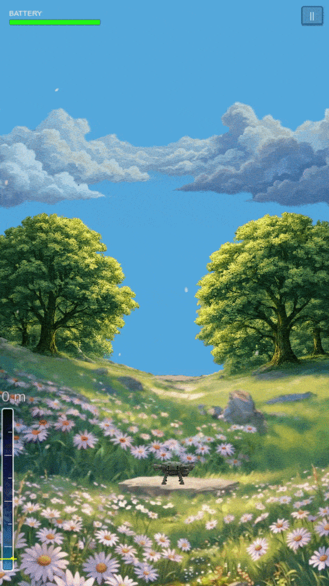
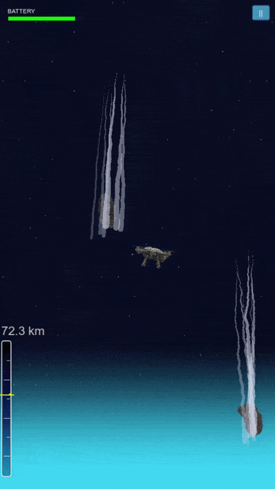

<div align="center">

# 🚁 DroneDash

**An endless climber where a battery-powered drone claws its way from the treetops to deep space.**

[](https://godotengine.org)
[](https://play.google.com/store/apps/details?id=com.abduloski.dronedash)
[](LICENSE)

<a href="https://play.google.com/store/apps/details?id=com.abduloski.dronedash">
  
</a>

</div>

---

<p align="center">
  
  &nbsp;
  
</p>

## About

DroneDash is a one-touch arcade climber for Android. Tap to boost, tilt to steer, and keep your battery alive as you rise through **15+ altitude zones** — dodging birds, storms, fighter jets, rockets, meteors and orbital debris. Recharge on clouds and energy orbs, bank coins on the way up, and upgrade your drone between runs.

## Features

- 🌍 **15+ altitude zones**, each with its own hazards — from city rooftops to deep space
- 🔋 **Battery management** — stay charged on clouds and energy orbs or you'll drop
- 🚀 **Boost, shield & momentum** mechanics, including a manual boost meter
- 🛠️ **Drone upgrades** — armor, battery, dash and boost, earned with coins
- 🏆 **Google Play Games leaderboards**
- 📱 **Phone & tablet** support with responsive camera framing

---

## Under the Hood

A few techniques from the build I'm happy with. Full files live in [`snippets/`](snippets/).

### ♻️ Zero-allocation object pooling

Hazards, pickups and effects spawn constantly, so they're recycled through a small pool instead of being instantiated and freed every time — no GC hitches mid-run. Returned objects reset themselves through an optional `reset_for_pool()` hook. → [`snippets/object_pool.gd`](snippets/object_pool.gd)

```gdscript
func get_object(scene: PackedScene) -> Node:
    var path = scene.resource_path
    if not pool.has(path):
        pool[path] = []

    # Reuse a still-valid recycled instance
    while pool[path].size() > 0:
        var obj = pool[path].pop_back()
        if is_instance_valid(obj):
            obj.visible = true
            obj.set_process(true)
            obj.set_physics_process(true)
            return obj

    # Pool empty or refs went stale — make a fresh one
    return scene.instantiate()
```

### 🌸 Procedural particles — no texture files

The ground-level petals don't ship a single PNG. The sprite is drawn pixel-by-pixel into an `Image` at startup and uploaded as a texture, which keeps the asset pipeline clean and sidesteps mobile import quirks. → [`snippets/petal_particles.gd`](snippets/petal_particles.gd)

```gdscript
func create_petal_texture() -> ImageTexture:
    var img = Image.create(16, 16, false, Image.FORMAT_RGBA8)
    for y in range(16):
        for x in range(16):
            var dx = (x - 8.0) / 8.0
            var dy = (y - 8.0) / 5.0   # elongated → petal shape
            var dist = sqrt(dx * dx + dy * dy)
            if dist < 1.0:
                var alpha = pow(1.0 - dist, 0.7)
                img.set_pixel(x, y, Color(1.0, 0.97, 0.94, alpha))
            else:
                img.set_pixel(x, y, Color(0, 0, 0, 0))
    return ImageTexture.create_from_image(img)
```

### 🌀 World-space rotor contrails

Two `Line2D` ribbons track each rotor tip in world space every physics frame, rotating the offsets with the drone and trimming to a fixed length so the trails follow the flight path. → [`snippets/contrail.gd`](snippets/contrail.gd)

```gdscript
func _physics_process(_delta: float):
    if not is_trailing:
        return
    var drone = get_parent()
    var rot = drone.sprite.rotation if drone.sprite else 0.0
    var left_pos  = drone.global_position + Vector2(-TRAIL_OFFSET_X, TRAIL_OFFSET_Y).rotated(rot)
    var right_pos = drone.global_position + Vector2( TRAIL_OFFSET_X, TRAIL_OFFSET_Y).rotated(rot)

    trail_left.add_point(left_pos)
    trail_right.add_point(right_pos)
    while trail_left.get_point_count() > MAX_POINTS:
        trail_left.remove_point(0)
    while trail_right.get_point_count() > MAX_POINTS:
        trail_right.remove_point(0)
```

### 💨 Fullscreen motion-blur shader

During a boost a fullscreen `canvas_item` shader runs a 7-tap vertical Gaussian over the screen texture, with the blur radius driven by a single `blur_amount` uniform that's tweened up and back down. → [`snippets/boost_blur.gdshader`](snippets/boost_blur.gdshader)

```glsl
void fragment() {
    vec2 px = SCREEN_PIXEL_SIZE;
    float r = 3.0 * blur_amount;
    vec3 acc = vec3(0.0);
    acc += texture(screen_tex, SCREEN_UV + vec2(0.0, -3.0 * r * px.y)).rgb * 1.0;
    acc += texture(screen_tex, SCREEN_UV + vec2(0.0, -2.0 * r * px.y)).rgb * 4.0;
    acc += texture(screen_tex, SCREEN_UV + vec2(0.0, -1.0 * r * px.y)).rgb * 8.0;
    acc += texture(screen_tex, SCREEN_UV                            ).rgb * 10.0;
    acc += texture(screen_tex, SCREEN_UV + vec2(0.0,  1.0 * r * px.y)).rgb * 8.0;
    acc += texture(screen_tex, SCREEN_UV + vec2(0.0,  2.0 * r * px.y)).rgb * 4.0;
    acc += texture(screen_tex, SCREEN_UV + vec2(0.0,  3.0 * r * px.y)).rgb * 1.0;
    COLOR = vec4(acc / 36.0, 1.0);
}
```

---

## Built with

- **Engine:** Godot 4.6 · GDScript
- **Platform:** Android — portrait, 1080×1920, GL Compatibility
- **Services:** Google Play Games (leaderboards), Firebase (analytics + crashlytics), AdMob

## Privacy

[Privacy Policy](https://x-haris.github.io/Drone-Dash-Policy/)
